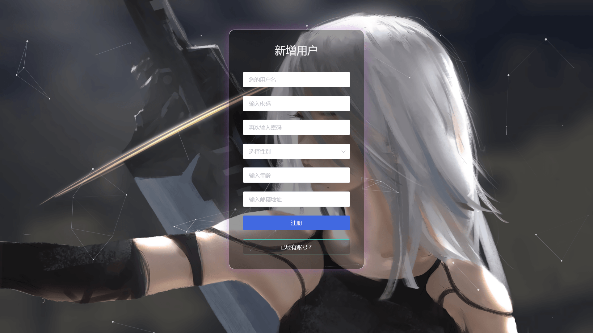
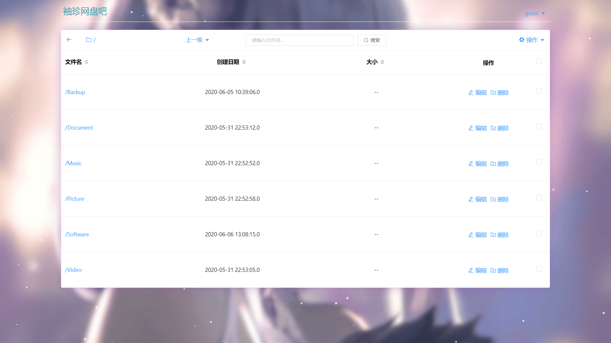
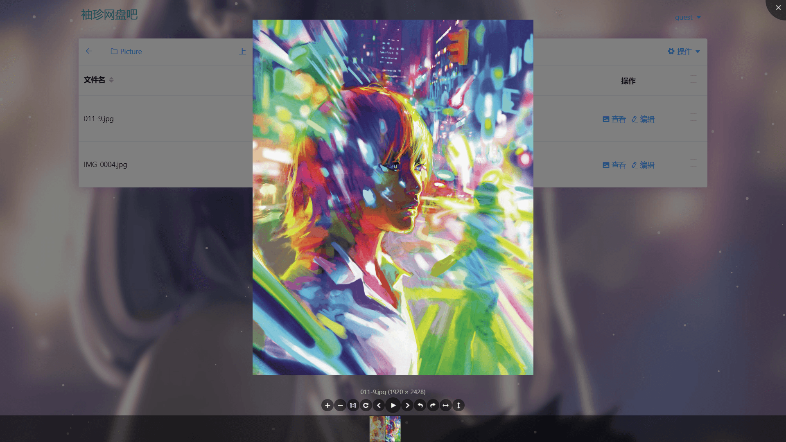
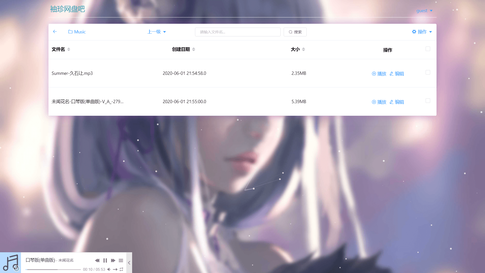
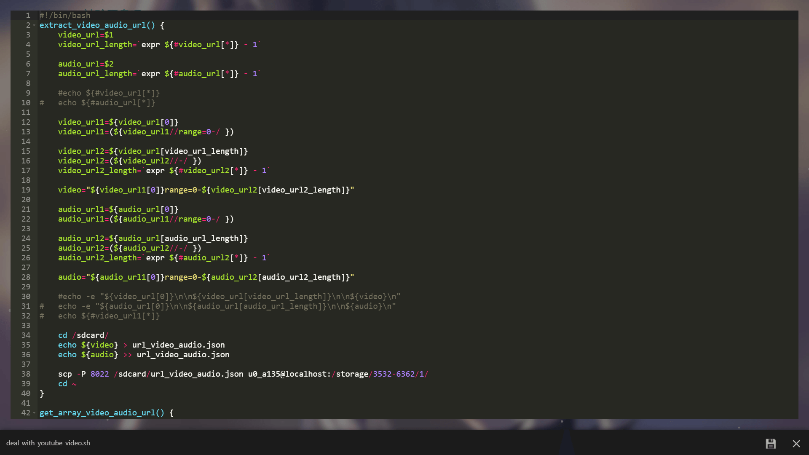
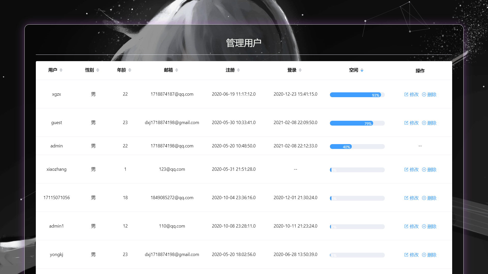

# 袖珍网盘吧（后端）

#### 介绍
本项目通过实现一个小巧的个人网盘系统，轻松管理上传到服务器上的文件，可在线预览一些常见的媒体文件，例如图片文件、音频文件、视频文件和文本文件等等，方便在不同的设备上访问服务器上的文件，做到手机和电脑之间快速访问服务器上的文件，实现文件的快速共享功能。主要功能包括用户登录 / 注册、文件管理(批量上传 / 移动 / 删除、离线下载、排序、搜索、重命名等)、文件在线预览(图片、音频、视频、文档等)、后台管理系统(用户)等。

#### 链接
袖珍网盘吧：[http://pocketyun.yongkj.cn/](http://pocketyun.yongkj.cn/)
> 账号：guest
> 密码：guest

#### 截图

#### 技术栈
MySQL+Spring+SpringMVC+MyBatis

1.  本系统采用前后端分离的开发方式，前端和后端分别新建一个项目，各自独立开发，互不干扰，彼此之间通过json数据进行交互
2.  后端采用SSM框架（Spring+SpringMVC+MyBatis）开发
3.  数据的跨域传输主要是通过配置Spring 拦截器来实现
4.  后台的数据存储主要采用开源的Mariadb数据库来完成

#### 功能特性

1.  用户可以注册新的账号，登录账号，登录之后也可以退出账号，修改账号信息，甚至修改账号，其中最高权限的账号可以删除其他账号
2.  每个用户的初始空间大小为1GB，当执行上传文件、删除文件或编辑文本文件的操作后，用户当前可使用的空间大小就会得到更新
3.  可对文件和文件夹进行基本的一些操作，可以新建文件夹，文件夹重命名，删除文件夹，也可以上传文件，下载文件（点击文件名即可下载文件），文件重命名，删除文件
4.  上传链接功能，可以上传文件下载链接（http或者https链接）到服务器上，实现文件的离线下载功能
5.  文件批量管理功能，批量移动文件或文件夹，批量删除文件或文件夹，批量上传文件
6.  文件排序功能，可对当前目录下的文件或文件夹进行排序操作，可以按照文件名、创建日期和文件大小升序或者降序排列
7.  文件搜索功能，可对当前目录下的文件或文件夹进行搜索操作，方便对文件或文件夹执行其他操作
8.  文件夹刷新功能，可以刷新当前目录，更新当前目录下的文件和文件夹，方便手机和电脑之间共享文件，当手机上传文件后，电脑即可刷新当前目录，查看上传的新文件
9.  文件预览功能，可以在线预览常见的媒体文件，例如浏览图片文件，播放音频文件，观看视频文件，查看文本文件等等
10. 除了可以查看文本文件以外，还可以编辑文本文件，常见的代码文件，例如可以高亮显示和编辑java文件、html文件、python文件、c文件等等

#### 使用说明

1.  pocket_yun.sql 为数据库备份文件
2.  可在 src/db.properties 配置文件中修改数据库连接信息
3.  如需打包部署服务器，则可以使用 Eclipse 或者 IDEA 打包项目，默认打包为 War 包
